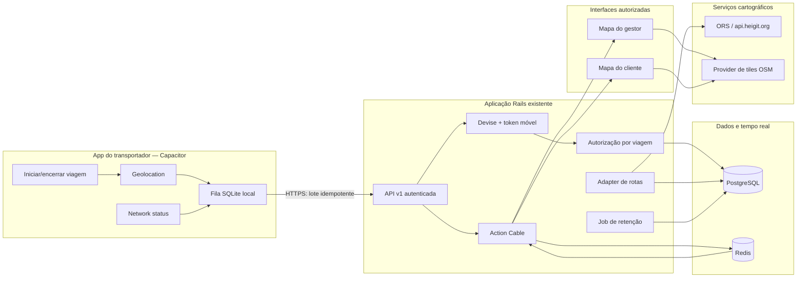

# Plano de implementação — MVP de rastreamento ponto a ponto

**Data:** 1º de setembro de 2026  
**Base:** `docs/AUDITORIA_MAPAS_RASTREAMENTO.md`  
**Estado:** proposta para aprovação; migrations, API de localização, mapa e aplicativo móvel ainda não implementados.

## 1. Resumo da solução

O menor MVP seguro reaproveita Rails, PostgreSQL, Redis/Action Cable, Leaflet e o frontend web atual. O transportador usa um aplicativo Capacitor para iniciar voluntariamente uma viagem, capturar GPS somente enquanto o app está em primeiro plano, guardar pontos temporariamente quando offline e enviá-los em lotes idempotentes. O backend valida, autoriza e persiste os pontos. Gestor e cliente autorizado veem a última posição por Leaflet e recebem atualizações via Action Cable autenticado, com snapshot HTTP como fonte inicial e fallback de polling.

Tecnologias prioritárias:

- Leaflet para renderização web;
- dados OpenStreetMap por um provedor de tiles compatível com uso comercial — o servidor público só durante desenvolvimento/piloto de baixo volume e dentro da política;
- OpenRouteService/HeiGIT chamado exclusivamente pelo backend para geocodificação e rota;
- Rails 7.1 como API e aplicação web;
- PostgreSQL no MVP; PostGIS recomendado quando forem implementadas geofences/distâncias espaciais;
- Redis obrigatório para Action Cable em ambiente com mais de um processo/instância;
- Capacitor 8 como contêiner Android/iOS da experiência web móvel;
- APIs nativas do Capacitor para geolocalização e rede;
- SQLite local no app para fila offline confiável, após aprovação da dependência;
- links externos para Google Maps e Waze, sem SDK de navegação embutido.

Não são necessários React Native, Firebase ou serviço pago no MVP. Capacitor é compatível com uma aplicação web existente, mas a aplicação Rails server-rendered precisa de uma pequena camada frontend móvel empacotável: o shell do app não deve depender de carregar páginas remotas para a coleta crítica. A documentação oficial confirma que Capacitor pode ser adicionado a projetos web existentes e expõe APIs nativas por plugins: [Capacitor](https://capacitorjs.com/docs).

## 2. Escopo e não escopo

### Incluído no MVP A

- origem e destino em texto e mapa;
- início/fim explícitos de viagem por transportador designado;
- GPS apenas com aplicativo visível/em uso;
- ponto único e lote offline;
- última posição e histórico básico;
- mapa de gestor e cliente vinculado;
- Action Cable autenticado;
- estado do sinal e idade da posição;
- rota prevista e distância restante aproximada;
- deep links Google Maps/Waze;
- retenção e exclusão programada;
- testes de autorização, contrato e reconexão.

### Fora do MVP A

- rastreamento garantido com tela bloqueada/app encerrado;
- navegação turn-by-turn embutida;
- desvio, atraso e parada automáticos sofisticados;
- otimização de múltiplas paradas;
- antifraude avançado/map matching;
- localização permanente ou oculta;
- self-hosting de toda a pilha OSM/ORS.

## 3. Arquitetura proposta



### Decisões principais

1. Persistir antes de transmitir: o broadcast ocorre somente depois do commit do ponto.
2. HTTP é o canal de ingestão; WebSocket é somente distribuição para espectadores. Isso simplifica reenvio, idempotência e auditoria.
3. A última posição exibida é um snapshot autorizado do servidor, nunca um evento WebSocket isolado.
4. A chave ORS fica apenas no backend.
5. O provider de rota é encapsulado por interface, evitando dependência permanente de ORS.
6. A localização pertence à viagem, não ao perfil permanente do transportador.

## 4. Fluxo completo

1. Cliente cria/contrata o frete e um transportador é designado.
2. Backend cria uma viagem `planejada` e geocodifica origem/destino no backend; usuário confirma endereços antes da operação.
3. Transportador autenticado abre a viagem e vê origem, destino e botões de navegação externa.
4. Ao tocar “Iniciar viagem”, o app mostra aviso de privacidade, solicita permissão durante o uso e chama `POST /api/v1/viagens/:id/iniciar`.
5. Backend confirma transportador designado, estado válido e ausência de outra sessão ativa; registra início e devolve configuração operacional.
6. App inicia `watchPosition`, filtra pontos obviamente ruins, grava primeiro na fila local e tenta enviar por HTTPS.
7. Backend autentica, autoriza, valida tempo/coordenadas/precisão, deduplica, persiste e atualiza `last_location_point_id` na mesma transação.
8. Após commit, Rails publica payload mínimo no canal da viagem.
9. Gestor ou cliente vinculado carrega snapshot HTTP, mapa/rota e então assina o canal autorizado.
10. Sem internet, o app mantém pontos ordenados na fila; na reconexão, envia lotes com idempotência, backoff e confirma quais itens podem ser apagados localmente.
11. Ao tocar “Encerrar viagem”, o app tenta esvaziar a fila, chama o endpoint de encerramento, interrompe `watchPosition` mesmo se a API falhar e mantém pendências para sincronização controlada.
12. Backend encerra sessão/viagem, transmite evento final e rejeita novos pontos, salvo pequena janela explícita para pendências capturadas antes do encerramento.

## 5. Modelagem proposta

### Escolha entre `trips/journeys`, `tracking_sessions` e `location_points`

Recomendação: manter três conceitos separados e usar nomes coerentes com o domínio atual em português:

- `viagens`: execução operacional do frete e seu estado;
- `sessoes_rastreamento`: cada período iniciado/encerrado voluntariamente, incluindo auditoria do aviso/consentimento;
- `pontos_localizacao`: amostras GPS imutáveis.

Separar sessões evita misturar uma retomada autorizada com a viagem inteira e registra precisamente quando a coleta esteve ativa. Para um MVP ainda menor, seria possível incorporar os campos da sessão em `viagens`, mas isso perde auditoria e dificulta reinício após falha; a economia não compensa.

### Migration proposta: `viagens`

| Coluna | Tipo | Regra |
|---|---|---|
| `id` | bigint | PK |
| `frete_id` | references | FK, `null: false`, inicialmente única se houver uma viagem por frete |
| `transportador_id` | references | FK, `null: false` |
| `status` | string | `planejada`, `ativa`, `concluida`, `cancelada`, `expirada` |
| `started_at` | datetime | preenchido no início |
| `ended_at` | datetime | preenchido no término |
| `tracking_started_at` | datetime | primeira sessão ativa |
| `tracking_ended_at` | datetime | última sessão encerrada |
| `last_location_point_id` | bigint | FK opcional adicionada após criar pontos |
| `origin_latitude/longitude` | decimal(10,7) | coordenadas confirmadas, não derivadas a cada mapa |
| `destination_latitude/longitude` | decimal(10,7) | idem |
| `planned_route_geojson` | jsonb | geometria/metadata mínima do provider; revisar termos de armazenamento |
| `route_provider` | string | auditoria/adapter |
| `route_calculated_at` | datetime | idade da rota |
| timestamps | datetime | padrão Rails |

Índices: único parcial por `frete_id` conforme regra de negócio; `(transportador_id, status)`; `status`; `ended_at`; FK de última posição. Check constraint de estados e pares lat/lon.

### Migration proposta: `sessoes_rastreamento`

| Coluna | Tipo | Regra |
|---|---|---|
| `viagem_id` | references | FK, `null: false` |
| `transportador_id` | references | FK, `null: false`, deve coincidir com a viagem |
| `status` | string | `ativa`, `encerrada`, `cancelada`, `expirada` |
| `started_at/ended_at` | datetime | limites explícitos |
| `consent_notice_version` | string | versão do aviso exibido |
| `permission_scope` | string | no MVP: `while_in_use` |
| `device_installation_id` | uuid | identificador aleatório do app, não hardware ID |
| `last_sequence` | bigint | apoio à sincronização |
| `stop_reason` | string | usuário, conclusão, cancelamento, segurança |
| timestamps | datetime | padrão Rails |

Índices: `(viagem_id, status)`; `(transportador_id, status)`; índice único parcial garantindo no máximo uma sessão ativa por viagem.

### Migration proposta: `pontos_localizacao`

| Coluna | Tipo | Regra |
|---|---|---|
| `viagem_id` | references | FK, `null: false` |
| `sessao_rastreamento_id` | references | FK, `null: false` |
| `transportador_id` | references | FK, `null: false`; duplicação controlada para auditoria/particionamento |
| `client_point_id` | uuid | idempotência gerada no aparelho |
| `sequence` | bigint | ordem por sessão |
| `latitude/longitude` | decimal(10,7) | `null: false`; checks −90..90 e −180..180 |
| `accuracy_m` | decimal(8,2) | `>= 0`; limite máximo aceito configurável |
| `speed_mps` | decimal(8,2) | opcional, `>= 0` |
| `heading_degrees` | decimal(6,2) | opcional, `0 <= x < 360` |
| `captured_at` | datetime | horário do aparelho, `null: false` |
| `received_at` | datetime | horário do servidor, `null: false`, default do banco |
| timestamps | datetime | `created_at` para auditoria; pontos não são atualizados |

Índices: único `(sessao_rastreamento_id, client_point_id)`; único `(sessao_rastreamento_id, sequence)`; `(viagem_id, captured_at)`; `(transportador_id, captured_at)`. PostGIS e índice GiST ficam para geofences/map matching; não são pré-requisito para a primeira posição/histórico.

### Models e invariantes

- `Frete has_one :viagem`; `Viagem belongs_to :frete, :transportador`.
- `Viagem has_many :sessoes_rastreamento, :pontos_localizacao` e `belongs_to :last_location_point, optional: true`.
- `SessaoRastreamento` só inicia se viagem estiver em estado permitido e transportador coincidir.
- `PontoLocalizacao` é append-only e só é aceito para sessão/viagem ativa, ou na janela de flush final se `captured_at` for anterior ao encerramento.
- Estado e timestamps são alterados por serviços transacionais (`IniciarViagem`, `RegistrarPontos`, `EncerrarViagem`), não diretamente por controllers.
- Validações Rails são repetidas como constraints no banco para coordenadas, estados e unicidade.
- Não existe campo de localização no perfil do transportador.

### Retenção

Proposta para aprovação: pontos detalhados por 90 dias após o fim; depois exclusão em lotes ou anonimização/agregação irreversível. Sessões e eventos de início/fim podem permanecer por prazo contratual/auditoria definido pelo jurídico sem coordenadas detalhadas. Um job diário elimina partições/lotes vencidos e registra apenas contagem, período e resultado. Legal hold precisa ser explícito, restrito e auditado.

## 6. Contrato da API segura

Base: `/api/v1`. JSON, TLS obrigatório, `Content-Type: application/json`, IDs opacos quando expostos externamente e horários ISO 8601 UTC.

### Endpoints

| Método e rota | Ator | Finalidade | Resposta principal |
|---|---|---|---|
| `POST /viagens/:id/iniciar` | transportador designado | inicia viagem/sessão | `201`, viagem, sessão, configuração |
| `POST /viagens/:id/posicoes` | transportador da sessão | envia um ponto; internamente usa o serviço de lote | `202`/`201`, aceito/duplicado |
| `POST /viagens/:id/posicoes/lote` | transportador da sessão | envia fila offline | `207` ou `200`, resultado por ponto e maior sequência confirmada |
| `GET /viagens/:id/ultima-posicao` | gestor/cliente/transportador autorizado | snapshot | `200`, posição, idade e estado do sinal |
| `GET /viagens/:id/historico` | gestor/cliente autorizado conforme política | histórico paginado/limitado | `200`, pontos simplificados/paginados |
| `POST /viagens/:id/encerrar` | transportador designado ou gestor autorizado | encerra coleta | `200`, estado final |
| `POST /viagens/:id/cancelar` | papéis definidos | cancela e encerra coleta | `200` |
| `GET /viagens/:id/rota` | usuário autorizado | rota/ETA prevista do backend | `200` ou `503 route_unavailable` |

### Payload de ponto/lote

```json
{
  "tracking_session_id": "uuid-ou-id-opaco",
  "points": [
    {
      "client_point_id": "uuid",
      "sequence": 42,
      "latitude": -23.0,
      "longitude": -47.0,
      "accuracy_m": 18.5,
      "speed_mps": 12.3,
      "heading_degrees": 95.0,
      "captured_at": "2026-09-01T14:00:00Z"
    }
  ]
}
```

Os números acima são apenas formato ilustrativo e nunca serão usados como coordenadas de teste de pessoas reais.

### Validação e limites iniciais configuráveis

- latitude/longitude finitas e dentro dos intervalos globais;
- `captured_at` não mais que 5 minutos no futuro;
- no envio online, idade máxima sugerida de 24 h; no flush após encerramento, somente pontos capturados durante a sessão e dentro da retenção de fila aprovada;
- lote máximo inicial sugerido: 100 pontos e 256 KiB; confirmar em teste de campo;
- precisão negativa ou campos não numéricos são rejeitados; precisão ruim pode ser aceita com flag ou rejeitada conforme limite testado;
- `client_point_id` e sequência obrigatórios; duplicatas retornam sucesso idempotente;
- rate limit por transportador/sessão e IP, separado do limite global. Ponto único: sugestão inicial 120/min; lote: 12/min. Ajustar após medição, não usar IP como identidade principal;
- erros padronizados: `401 unauthenticated`, `403 forbidden`, `404 not_found` (sem enumerar viagens), `409 invalid_state`, `422 invalid_location`, `429 rate_limited`, `503 route_unavailable`.

### Logs

Registrar request ID, usuário interno, viagem, contagem de pontos, status, latência e códigos de rejeição. Não registrar token, payload, endereço completo, latitude/longitude, URL com chave, corpo do provider ou stack trace contendo parâmetros. Logs administrativos de acesso guardam quem consultou qual viagem e quando, não o ponto consultado.

## 7. Autenticação e autorização

### Web

- manter sessões Devise para cliente, transportador e administrador;
- `ApplicationCable::Connection` resolve a mesma sessão e rejeita conexão anônima;
- cada canal carrega a viagem no servidor e autoriza novamente; o nome do stream/ID enviado pelo cliente nunca concede acesso.

### Aplicativo

Recomendação: token Bearer curto, revogável e rotacionado, armazenado no Keychain/Keystore; refresh token com rotação e vínculo a instalação. A dependência open source `devise-jwt` ou implementação equivalente precisa de aprovação. Cookies de sessão dentro do WebView podem servir a uma prova técnica, mas não são a arquitetura recomendada para sincronização nativa/offline.

### Matriz de autorização

| Ação | Transportador | Cliente | Gestor/admin |
|---|---|---|---|
| iniciar/enviar/encerrar | somente designado e viagem válida | não | encerramento/cancelamento excepcional auditado |
| última posição | sua viagem ativa | somente frete próprio e janela válida | conforme função operacional |
| histórico | próprio, se necessário | próprio, com granularidade/prazo definidos | conforme função e auditoria |
| canal | mesma regra do snapshot | mesma regra do snapshot | mesma regra do snapshot |
| link temporário | não aplicável | alternativa opcional e revogável | emite/revoga se autorizado |

Links temporários, se aprovados, usam token aleatório de alta entropia armazenado apenas como digest, escopo de uma viagem, validade curta, revogação e limite de uso. Preferência do MVP: cliente autenticado. Link público não é requisito inicial.

## 8. Mapa do gestor e cliente

A tela Leaflet recebe do backend:

- origem/destino confirmados;
- GeoJSON da rota prevista;
- última posição autorizada;
- `captured_at`, `received_at`, precisão e estado da viagem;
- distância restante estimada e horário de cálculo.

Estados sugeridos, calculados pelo servidor e confirmados em piloto:

- `online`: atualização recente e precisão aceitável;
- `sinal_fraco`: recente, mas baixa precisão;
- `sem_atualizacao`: idade acima do limiar;
- `encerrada`: viagem finalizada/cancelada.

UI: marcadores distintos, polyline, horário/idade da posição, aviso de dado desatualizado, botão “Ajustar à rota”, legenda de precisão e estado de conexão. O cliente vê somente a carga vinculada e, por padrão, não recebe histórico após a janela operacional. O gestor usa a mesma API, com papel auditado.

Action Cable envia payload mínimo (`viagem_id`, posição, precisão, horários, estado e sequência). Ao reconectar, a UI descarta eventos anteriores à sequência conhecida e recarrega o snapshot. Se o WebSocket falhar, polling com `ETag`/`If-None-Match` a cada 30–60 s enquanto a tela estiver visível.

## 9. Aplicativo Capacitor

### Tela de viagem

- cartão de origem/destino;
- “Iniciar viagem”;
- “Abrir no Google Maps” usando URL universal;
- “Abrir no Waze”, com fallback web se o app não estiver instalado;
- indicadores de GPS, internet, última sincronização e itens pendentes;
- aviso de finalidade/privacidade;
- “Encerrar viagem” com confirmação e estado de flush.

URLs de navegação são geradas com coordenadas/endereço já autorizados, codificados e sem chave. Abrir navegação externa não inicia rastreamento e iniciar rastreamento não abre navegação: são capacidades separadas.

### Versão A — primeiro plano (MVP recomendado)

Usa o plugin oficial de Geolocation com `watchPosition` apenas enquanto a tela/atividade está efetivamente em uso. Ao perder visibilidade ou ser suspenso pelo sistema, o app informa que as atualizações podem parar. Vantagens: menor risco de loja/LGPD, implementação mais curta e consumo menor.

Limitação central: não promete rastreamento contínuo com tela bloqueada, app minimizado ou encerrado. Em trajetos longos, isso reduz muito a cobertura; a UI precisa ser honesta e pode manter a tela ativa mediante escolha do usuário, sem burlar o sistema.

### Versão B — segundo plano (posterior)

Exige plugin/implementação nativa específica, permissões e justificativas adicionais:

- Android: foreground service, notificação persistente, permissões compatíveis com a versão e tratamento de Doze;
- iOS: background location mode, textos de finalidade, indicadores do sistema e revisão rigorosa da App Store;
- testes reais com tela bloqueada, encerramento pelo sistema e fabricantes Android agressivos;
- nova revisão LGPD/RIPD e política de loja.

Não implementar B até o piloto A demonstrar necessidade e o usuário aprovar plugin, textos, base legal e custo de manutenção. O plugin oficial de geolocalização não deve ser presumido como solução completa de background.

### Offline

Cada ponto nasce com UUID e sequência, é gravado localmente antes do envio e muda de estado `pending → in_flight → acknowledged`. Falha volta a `pending`. Reenvio usa lotes, backoff exponencial com jitter e gatilho de reconexão do plugin Network. Nunca apagar por mero HTTP 2xx sem confirmação dos IDs/sequência. Limitar fila por tempo e tamanho; informar ao usuário quando o limite estiver próximo. Dados locais devem ser protegidos por mecanismos do sistema e excluídos após confirmação/encerramento + prazo curto.

## 10. Frequência e economia de bateria/dados

Não fixar intervalo definitivo antes do piloto. Implementar configuração remota segura com limites mínimos/máximos e testar perfis:

- em movimento: candidato inicial de 15–30 s e/ou 100–250 m;
- parado de forma consistente: reduzir para 2–5 min;
- perto de origem/destino: temporariamente 10–15 s;
- enviar imediatamente início, fim, retomada de rede e mudança relevante;
- agrupar offline e compactar JSON/HTTP quando vantajoso;
- não transmitir cada callback bruto do GPS;
- reduzir precisão/frequência com bateria baixa, sem esconder perda de qualidade;
- encerramento automático de segurança apenas após período aprovado, aviso ao usuário e confirmação quando possível.

Métricas do piloto: mAh/h, MB/h, pontos aceitos/rejeitados, atraso p50/p95, duração offline, tamanho de lote, carga da API, conexões Cable e custo por viagem.

## 11. LGPD e segurança

- finalidade: acompanhamento da carga durante viagem contratada;
- aviso claro ao transportador antes do início, com versão registrada; consentimento não deve ser usado automaticamente como única base legal sem validação do DPO/jurídico;
- coleta mínima e proibição técnica de pontos fora de sessão ativa;
- registro auditável de início, fim, ator e motivo;
- cliente restrito ao próprio frete; gestor por função e necessidade;
- links temporários expiram e podem ser revogados imediatamente;
- auditoria de consultas e exportações, com retenção própria;
- pontos detalhados por 90 dias como proposta, sujeita a autorização jurídica;
- exclusão/anonimização verificável e procedimento para solicitações do titular;
- criptografia em trânsito, banco/backups e fila local; segredos em cofre/ambiente;
- rotação de tokens/chaves, rate limit, idempotência e alerta de abuso;
- proibição de uso secundário para marketing, score ou disciplina sem nova análise;
- RIPD, contratos com operadores e transferências internacionais revisados antes do piloto externo.

## 12. Correções críticas isoladas preparadas nesta etapa

As seguintes alterações foram preparadas no código, sem deploy:

1. chave ORS removida do JavaScript legado e chamada externa no navegador eliminada;
2. variável `OPENROUTESERVICE_API_KEY` documentada sem valor no `.env.example` e destinada somente ao backend;
3. distância aleatória removida de `CalcularFrete`;
4. ausência/falha do ORS agora retorna mensagem clara de indisponibilidade, sem produzir preço baseado em distância fictícia;
5. logs desse serviço não incluem mensagem potencialmente sensível da exceção;
6. rota HTML de rastreamento limitada a admin, cliente dono ou transportador designado;
7. conexão Action Cable exige sessão Devise autenticada;
8. canal de rastreamento carrega o frete e repete autorização por tipo de usuário/vínculo.

A chave removida continua comprometida no histórico Git. Ação operacional manual necessária: revogar, verificar consumo e criar outra chave; não reutilizar o valor antigo. Limpar histórico Git é uma decisão separada e disruptiva, não executada.

O endpoint antigo `api.openrouteservice.org` está depreciado em 2026 e teve quota reduzida; o desligamento anunciado é 28 de setembro de 2026. Antes de habilitar rotas, consolidar os serviços e migrar para `api.heigit.org` conforme anúncio oficial: [migração ORS/HeiGIT](https://ask.openrouteservice.org/t/deprecating-api-openrouteservice-org-in-favour-of-api-heigit-org/7912) e [redução de quota](https://ask.openrouteservice.org/t/reducing-the-quota-of-deprecated-api-api-openrouteservice-org/8013).

## 13. Plano de testes

### Backend/modelos

- constraints, estados e transições concorrentes;
- nenhuma sessão ativa duplicada;
- ponto fora da sessão/viagem ativa rejeitado;
- coordenadas/horários/precisão inválidos;
- idempotência por UUID e sequência;
- lote parcial, duplicado, fora de ordem e acima do limite;
- atualização atômica da última posição;
- retenção sem apagar viagem ativa/legal hold.

### Autenticação/autorização

- anônimo, cliente de outro frete e transportador não designado recebem rejeição sem enumeração;
- cliente dono, transportador designado e admin permitido recebem somente escopo previsto;
- mesmos casos para HTTP e Action Cable;
- token expirado/revogado, sessão encerrada e link temporário expirado/revogado;
- rate limit por ator/sessão e resposta `429`.

### Integração/tempo real

- persistência ocorre antes do broadcast;
- reconexão carrega snapshot e descarta evento antigo;
- múltiplas instâncias Rails via Redis;
- degradação quando Redis/ORS/tiles estão fora;
- Cable nunca transmite histórico/payload além do necessário.

### App e offline

- permissão negada, precisão reduzida e GPS desligado;
- alternância Wi‑Fi/4G/modo avião;
- fila sobrevive a reinício do app;
- lote retoma sem duplicar e mantém ordem;
- encerramento interrompe watcher mesmo com API indisponível;
- app não captura antes do início/depois do fim;
- bateria/dados em aparelhos Android/iOS representativos.

### UI/mapa

- origem/destino/rota/posição e ajuste de bounds;
- estados online/fraco/desatualizado/encerrado;
- posição velha não parece atual;
- deep links codificados e fallback;
- acessibilidade e telas pequenas.

### Segurança e carga

- IDOR em todos os endpoints/canais;
- replay, timestamps adulterados, lote enorme, JSON inválido e rate limiting;
- segredo/coordenada ausentes de logs e respostas de erro;
- carga com volume projetado × margem, incluindo reconexões simultâneas.

Os testes das correções isoladas devem rodar antes de merge. Neste checkout, `bundle exec rails` continua indisponível por gems/executáveis não instalados; por isso a validação desta etapa ficou limitada a sintaxe e inspeção de diff. Instalar dependências e preparar banco de teste requer autorização/ambiente adequado.

## 14. Estratégia de rollout e rollback

### Rollout

1. merge das correções críticas após testes;
2. migrations aditivas sem ativar coleta;
3. API atrás de feature flag, apenas equipe interna;
4. app A em distribuição interna, sem lojas;
5. mapa somente para gestores piloto;
6. cliente piloto autenticado;
7. ampliar gradualmente medindo bateria, custo, precisão e incidentes.

### Rollback

- feature flags independentes para iniciar GPS, ingestão, broadcast, mapa cliente e ORS;
- migrations inicialmente somente aditivas; rollback de aplicação não remove tabelas/dados;
- desativar ingestão retorna erro explícito e manda app parar coleta, preservando fila por janela definida;
- desativar Action Cable mantém snapshot/polling;
- falha ORS mantém viagem/rastreamento, mas mostra rota indisponível — nunca inventa distância;
- troca de tiles/provider por configuração, sem atualização do app;
- reversão destrutiva de schema somente após backup, período de observação e aprovação separada;
- plano de incidente para revogar tokens/links e suspender visualização sem apagar evidências necessárias.

## 15. Estimativa por etapas

Premissa: 1 backend Rails, 1 frontend/mobile e QA/segurança compartilhados. Intervalos incluem testes e revisão, não publicação em lojas.

| Etapa | Entrega | Estimativa |
|---|---|---|
| 0 | aprovações, LGPD, rotação ORS, consolidação do adapter e ambiente de testes | 3–5 dias |
| 1 | migrations/models/serviços transacionais e retenção | 1–2 semanas |
| 2 | API autenticada, lote/idempotência/rate limit e testes | 1,5–2,5 semanas |
| 3 | mapa Leaflet gestor/cliente, rota e Action Cable | 1,5–2,5 semanas |
| 4 | shell Capacitor A, GPS foreground, rede, fila SQLite e deep links | 2–3 semanas |
| 5 | integração, carga, segurança, bateria e piloto interno | 1–2 semanas |

**Menor versão demonstrável interna:** 4–6 semanas — uma viagem, foreground, última posição e gestor.  
**MVP A completo e pilotável:** 7–10 semanas.  
**Versão B em segundo plano:** adicionar aproximadamente 3–6 semanas, após aprovação e pesquisa específica de plugins/políticas.

## 16. Custos gratuitos e possíveis custos futuros

### Inicialmente gratuitos/open source

- Rails, PostgreSQL, Redis, Leaflet e Capacitor: licenças open source;
- dados OpenStreetMap: abertos sob ODbL, com atribuição/licença;
- ORS Standard: 0 €, com limites publicados — atualmente até 2.000 Directions/dia e 1.000 geocodificações/dia no plano listado. Fonte: [planos ORS](https://openrouteservice.org/plans/);
- links Google Maps/Waze: sem API paga para apenas abrir o aplicativo/site de navegação;
- desenvolvimento/teste local do app: sem taxa de loja.

### Custos que surgem com crescimento

- hosting/CPU/RAM e conexões WebSocket;
- Redis gerenciado e alta disponibilidade;
- armazenamento, índices, backup e transferência do histórico;
- provedor comercial de tiles OSM com SLA/quota;
- geocoding/roteamento comercial ou infraestrutura própria ORS/Nominatim;
- observabilidade, segurança, pentest e atendimento LGPD;
- Apple Developer Program: US$ 99/ano para distribuição, conforme [Apple](https://developer.apple.com/programs/whats-included/);
- distribuição Android ampla: taxa única de US$ 25 no programa aplicável, conforme [Google](https://support.google.com/android-developer-console/answer/16604405);
- plugin comercial de background location, caso a opção open source/nativa não cumpra confiabilidade e manutenção;
- equipe para suporte a versões Android/iOS e políticas de loja.

### Limitações comunitárias

- `tile.openstreetmap.org` é best-effort, sem SLA, capacidade financiada por doações e sujeito a bloqueio: [política de tiles OSMF](https://operations.osmfoundation.org/policies/tiles/);
- Nominatim público limita uso a 1 req/s, exige identificação/cache e não deve receber dados pessoais/confidenciais nem sustentar rastreamento comercial: [política Nominatim](https://operations.osmfoundation.org/policies/nominatim/);
- ORS gratuito possui quotas/restrições, inclusive até 50 waypoints e limites por perfil: [restrições ORS](https://openrouteservice.org/restrictions/);
- “OpenStreetMap gratuito” significa dados abertos, não infraestrutura pública ilimitada.

## 17. Arquivos que seriam criados ou modificados

### Já modificados nesta etapa crítica

- `.env.example`;
- `app/javascript/rastreamento.js`;
- `app/services/calcular_frete.rb`;
- `app/controllers/fretes_controller.rb`;
- `app/channels/application_cable/connection.rb`;
- `app/channels/rastreamento_channel.rb`;
- `docs/PLANO_MVP_RASTREAMENTO.md`.

### Propostos para a implementação aprovada

- migrations `create_viagens`, `create_sessoes_rastreamento`, `create_pontos_localizacao`, `add_last_location_point_to_viagens`;
- models `viagem.rb`, `sessao_rastreamento.rb`, `ponto_localizacao.rb` e associações em `frete.rb`/`transportador.rb`;
- controllers API v1 para viagens, posições e rotas;
- policies/serviços de autorização e domínio;
- serializers JSON sem dados excessivos;
- adapter ORS/HeiGIT único e cache;
- jobs de retenção e expiração segura;
- throttles específicos em `config/initializers/rack_attack.rb`;
- canais e JavaScript de assinatura por viagem;
- view/componente Leaflet de acompanhamento;
- rotas Rails versionadas;
- testes de models, requests, channels, services e system;
- diretório/projeto Capacitor com configurações Android/iOS, plugins Geolocation/Network e fila SQLite;
- textos de privacidade/permissões e documentação operacional;
- feature flags e métricas.

## 18. Dependências necessárias

### Sem nova dependência imediata

Leaflet, Action Cable, Redis, PostgreSQL, Devise e Rack::Attack já estão no projeto.

### Dependências propostas, sujeitas a aprovação

- `@capacitor/core`, `@capacitor/cli`, `@capacitor/android`, `@capacitor/ios`;
- `@capacitor/geolocation`, `@capacitor/network`, `@capacitor/app`;
- plugin SQLite mantido e auditado para fila offline;
- autenticação token open source como `devise-jwt`, ou contrato próprio revisado;
- PostGIS/`activerecord-postgis-adapter` apenas quando geofences/consultas espaciais justificarem;
- mecanismo de feature flags — simples no banco/configuração existente ou gem após avaliação.

## 19. Questões que exigem autorização

1. Aprovar as correções críticas já preparadas para futura inclusão, após instalação de dependências e testes.
2. Autorizar revogação/rotação da chave ORS no painel do provedor e verificação de consumo; esta ação externa não foi feita.
3. Aprovar MVP A foreground sabendo que ele para de atualizar quando o sistema suspende o app/tela.
4. Aprovar a modelagem em três tabelas e retenção proposta de 90 dias, condicionada ao jurídico/DPO.
5. Definir quem é “gestor” e quais funções podem ver histórico/última posição.
6. Escolher sessão autenticada como única via do cliente no MVP ou autorizar links temporários revogáveis.
7. Aprovar autenticação móvel por tokens rotacionáveis e a dependência escolhida.
8. Aprovar plugin SQLite e política de proteção/expiração da fila local.
9. Aprovar uso inicial do ORS gratuito via novo domínio HeiGIT e provider de tiles do piloto; não usar endpoints públicos como promessa de SLA.
10. Autorizar instalação de gems/packages, criação/execução de migrations em desenvolvimento/teste e preparação do banco de teste.
11. Autorizar uma fase posterior de background location somente após resultados do piloto e análise de loja/LGPD.
12. Aprovar orçamento/contas de Apple/Google somente quando houver decisão de distribuição; nenhuma publicação está incluída.

Nenhum deploy, commit, push, publicação em loja ou alteração de banco de produção faz parte desta entrega.
